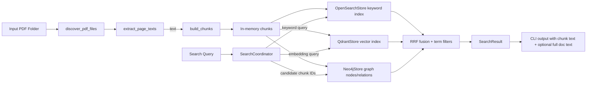

# Architecture Decision Record Pack

## 1) Problem framing

The system is designed for industrial PDF search where relevance depends on multiple evidence types:

- keyword search for exact terminology and compliance phrases,
- semantic search for near-matches and paraphrasing,
- graph-based expansion for linked clauses and neighboring sections.

A single answer path that blends these modes gives higher recall and better citation stability than any one method alone.

## 2) ADR-001: Multi-store retrieval instead of single-vector only

### Context
Pure vector search loses precision for short exact terms common in design requirements. Keyword stores alone miss synonymy and conceptual matches.

### Decision
Use three backends with weighted fusion:

- OpenSearch for keyword matching.
- Qdrant for vector matching.
- Neo4j for graph-based expansion.

### Consequences
- Higher compute complexity and more operational dependencies.
- Better relevance and evidence quality.
- Easy to add a fourth mode later by implementing the same `SearchCandidate` contract.

## 3) ADR-002: Recency-robust ingestion over single-pass parsing

### Decision
Ingestion is best-effort and recursive:

- recursively discover PDFs,
- build chunks for all readable files,
- skip unreadable files and continue rather than aborting the entire job.

### Consequences
- Improved resilience for large heterogeneous libraries.
- Operators must inspect skip-reporting before trusting completeness.

## 4) ADR-003: Workspace split into `app` and `core`

### Decision
Keep CLI orchestration in `app` and domain/search/data contracts in `core`.

### Consequences
- Clear dependency direction (`app` depends on `core`, never reverse).
- Simpler test boundaries.
- Supports future package-level reuse of `core`.

## 5) ADR-004: Deterministic metadata + source traceability

### Decision
Each chunk tracks `document_id`, `source_path`, and text variants.

### Consequences
- Search output can reliably return `document_id`, source file path, and chunk text.
- Easier evidence verification and audit trails.

## 6) ADR-005: Multimodal OCR fallback

### Decision
If a PDF has no readable text, optionally route to `LLM_OCR_ENDPOINT` and parse JSON pages/text fallback.

### Consequences
- Better coverage on scanned/embedded-image PDFs.
- Requires additional secure endpoint and API key management.

## 7) Data flow diagram

## 8) Core interfaces

- `Store traits` in `crates/core/src/traits.rs`
  - `KeywordIndex`, `VectorIndex`, `GraphIndex` as async contracts.
- `SearchCoordinator` in `crates/core/src/orchestrator.rs`:
  - validates empty query,
  - runs keyword and vector lookups concurrently,
  - applies RRF-style fusion,
  - enriches with graph expansion,
  - applies required/blocked term filters.
- `Ingestion pipeline` in `crates/core/src/ingest.rs`:
  - recursive discovery,
  - optional skip strategy,
  - deterministic chunking.
- `Extractor` in `crates/core/src/extractor.rs`:
  - `LopdfExtractor` first,
  - then optional `LLM_OCR` when no readable text.
